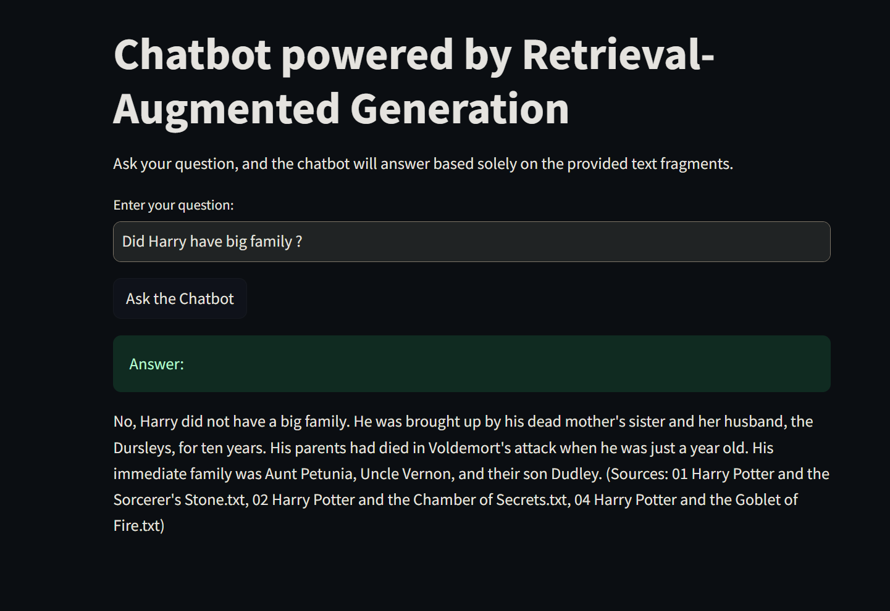

# Chatbot Retrieval-Augmented Generation (RAG Chatbot)

Ten projekt to chatbot oparty na metodzie **Retrieval-Augmented Generation (RAG)**, który odpowiada na pytania użytkownika, wyszukując odpowiednie fragmenty tekstu z bazy wiedzy i generując odpowiedzi za pomocą modelu językowego. Wszystkie odpowiedzi opierają się wyłącznie na dostarczonych dokumentach, a źródła są jasno podane.

---

---

## Kluczowe funkcje
- **Przetwarzanie dokumentów**: Wczytuje, czyści i dzieli tekst na mniejsze fragmenty (chunki) w celu efektywnego przeszukiwania.
- **Tworzenie wektorów tekstowych**: Wektoryzuje fragmenty tekstu za pomocą modeli, takich jak `sentence-transformers`.
- **Wyszukiwanie wektorowe**: Korzysta z bazy danych FAISS do wyszukiwania najbardziej pasujących fragmentów tekstu.
- **Integracja z modelem językowymi**: Generuje odpowiedzi za pomocą OpenAI GPT (np. `gpt-3.5-turbo`) 
- **Cytowanie źródeł**: Wszystkie odpowiedzi zawierają informacje o źródłach.

---

## Instalacja

1. **Sklonuj repozytorium**
   ```bash
   git clone https://github.com/Pi0tr71/Rag_chatbot_openai.git
   cd Rag_chatbot_openai
   ```

2. **Utwórz środowisko**
   Utwórz środowisko w Conda:
   ```bash
   conda env create -f env.yml
   conda activate rag-env
   ``

3. **Skonfiguruj klucz API**
   - Utwórz plik `.env` w głównym katalogu projektu.
   - Dodaj swój klucz API OpenAI:
     ```
     OPENAI_API_KEY=sk-xxxxxxxxxxxxxxxxxxxxxxxxxxxxxxxxxxxx

     lub wpisz klucz w pliku openai_llm.py
     api_key_def = os.getenv("sk-...")
     ```
---

## Użycie

### Uruchomienie chatbota
1. Uruchom interfejs chatbota za pomocą Streamlit:
   ```bash
   streamlit run chatbot_app.py
   ```

2. Wpisz pytanie w interfejsie. Chatbot wyszuka odpowiednie fragmenty tekstu w bazie wiedzy, wygeneruje odpowiedź i wyświetli źródła.
